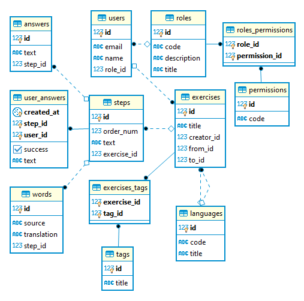

  

# Translate-It-API

## Summary

This is a backend part of the app. The frontend code is located in the [repo](https://github.com/kshashov/Translates-Frontend).

The application is a simple analog of [writing section of Puzzle English](https://puzzle-english.com/writing/verb-tenses).

The main entities here are multi-phrase exercises. Users are supposed to solve these exercises by gradually translating each phrase from the source language to the target language.

Users with the required permissions can modify other's user roles, solve, create, modify and delete exercises.

### Technologies

* Java 11
* JWT
* Spring Boot 2.X
    * Data
    * Test
    * OAuth2 Client (For Google OpenID)
* (TODO) JUnit 5 + Mockito 
* [Swagger](https://translate-it-api.herokuapp.com/swagger-ui.html)
### Database scheme

There are two options for initializing the scheme:
* _test_ profile: uses in-memory **H2** with `hibernate.ddl-auto = create` flag
* _prod_ profile: uses **PostgreSQL** with **Flyway** migrations

### CI/CD

* **Travis CI** - buids, tests, sending jacoco reports to **Codecov**
* **Heroku** - deploying to [https://translate-it-api.herokuapp.com](https://translate-it-api.herokuapp.com)

